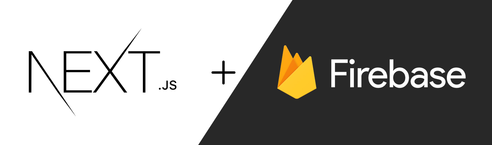

<div align="center">
	<strong>A Next.js template with firebase user authentication implemented to quickly get you started with your project</strong>
</div>

<br>

<div align="center">
	
	<a href="https://stars.github.com/nominate/">
		
	</a>
</div>


- **PWA**: A progressive web app so you can also install and use it as a desktop app
- **Firebase Auth**: Contains all the code you may need to setup user sign up and login features in your project
- **State Management**: State Management with ~~Redux~~ React's Context API
- **Prettier**: Integrated Prettier to easily format the code with `npm run format`
- **MIT Licensed**: Free to use for personal and commercial use

## 🚀 Usage

#### 🏗 Firebase Setup

1. Create a firebase project first then create a web app in that project.
2. Once you have done this, you will get some config keys like API key, auth domain, etc. Make sure you save it somewhere.
3. Click on Authentication from the left sidebar, go to `Sign-in method` and enable `Email/Password`.

#### 💥 Template Setup

1. Either fork the repo or click on the `Use this template` button to create a new repository with this template.
2. Now clone the repo, open it in your preferred code editor, and install all the dependencies using `npm install`.
3. Create a `.env.local` file in the root directory and paste the following in there.

```env
NEXT_PUBLIC_Firebase_API_Key=YOUR_API_KEY_GOES_HERE
NEXT_PUBLIC_Auth_Domain=YOUR_AUTH_DOMAIN_GOES_HERE
NEXT_PUBLIC_Project_Id=YOUR_PROJECT_ID_GOES_HERE
NEXT_PUBLIC_Storage_Bucket=YOUR_STORAGE_BUCKET_GOES_HERE
NEXT_PUBLIC_Message_Sender_Id=YOUR_MESSAGE_SENDER_ID_GOES_HERE
NEXT_PUBLIC_App_Id=YOUR_APP_ID_GOES_HERE
```

4. Replace the values above with the keys you got when you set up the web app. (Firebase Setup #2)
5. Now open your terminal and type in `npm run dev` to start the server.

## 🎩 Preview


## 👨🏻‍💻 Contributing

Make sure you read the [contributing guidelines](https://github.com/msaaddev/next-firebase-auth-template/blob/main/contributing.md) before opening a PR. 

## ⚡️ Other Projects

I have curated a [detailed list](https://github.com/msaaddev/open-source) of all the open-source projects I have authored. Do take out a moment and take a look.

## 🔑 License & Conduct

- MIT © [Saad Irfan](https://github.com/msaaddev)
- [Code of Conduct](https://github.com/msaaddev/next-firebase-auth-template/blob/main/code-of-conduct.md)
